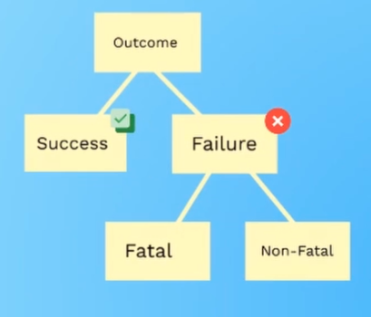
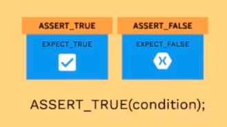
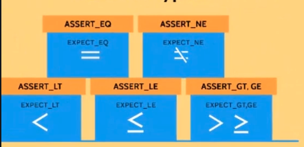

# Assertion

ASSERTION MACROS

Gtest has a rich set of assetions.
```cpp
ASSERT_EQ(5, 5);
ASSERT_GE(5, 0);
ASSERT_FLOAT_EQ(4.4, 4.4444444287381217);
ASSERT_TRUE(somePtr);
ASSERT_EQ(c1.size(), c2.size())<< "Vectors c1 and c2 are of unequal length";
ASSERT_THROW(c1.at(47374), std::out_of_range);
ASSERT_DEATH(c1[47374], "Assertion failed:*");
```

EXPECT_* AND ASSERT_*
```cpp
// assertions abort test if they fail
ASSERT_TRUE(somePtr);
// even if expectations fail, the test continues
// allows multiple failures to be recorded in one test pass
EXPECT_EQ("donald", somePtr->name());
EXPECT_EQ(105, somePtr->age());
```

## Assertion results 

There are 2 outcomes of assertion: Success or Failure. Failure can be Fatal or Non-Fatal. 
-   The Fatal failure means if the conditions are not satified tests will not continue.
- The Non-Fatal failure means that the test execution continues though it fails.

The Fatal Assertions start with ASSERT_* and the non-fatal assertions start with EXPECT_*




## Assertion types

### Basic Assertions

These assertions do basic true/false condition testing.



Fatal assertion            | Nonfatal assertion         | Verifies
-------------------------- | -------------------------- | --------------------
`ASSERT_TRUE(condition);`  | `EXPECT_TRUE(condition);`  | `condition` is true
`ASSERT_FALSE(condition);` | `EXPECT_FALSE(condition);` | `condition` is false

Remember, when they fail, `ASSERT_*` yields a fatal failure and returns from the
current function, while `EXPECT_*` yields a nonfatal failure, allowing the
function to continue running. In either case, an assertion failure means its
containing test fails.

### Binary Comparison

This section describes assertions that compare two values.



Fatal assertion          | Nonfatal assertion       | Verifies
------------------------ | ------------------------ | --------------
`ASSERT_EQ(val1, val2);` | `EXPECT_EQ(val1, val2);` | `val1 == val2`
`ASSERT_NE(val1, val2);` | `EXPECT_NE(val1, val2);` | `val1 != val2`
`ASSERT_LT(val1, val2);` | `EXPECT_LT(val1, val2);` | `val1 < val2`
`ASSERT_LE(val1, val2);` | `EXPECT_LE(val1, val2);` | `val1 <= val2`
`ASSERT_GT(val1, val2);` | `EXPECT_GT(val1, val2);` | `val1 > val2`
`ASSERT_GE(val1, val2);` | `EXPECT_GE(val1, val2);` | `val1 >= val2`


### String Comparison

The assertions in this group compare two **C strings**. If you want to compare
two `string` objects, use `EXPECT_EQ`, `EXPECT_NE`, and etc instead.

<!-- mdformat off(github rendering does not support multiline tables) -->

| Fatal assertion                | Nonfatal assertion             | Verifies                                                 |
| --------------------------     | ------------------------------ | -------------------------------------------------------- |
| `ASSERT_STREQ(str1,str2);`     | `EXPECT_STREQ(str1,str2);`     | the two C strings have the same content   		     |
| `ASSERT_STRNE(str1,str2);`     | `EXPECT_STRNE(str1,str2);`     | the two C strings have different contents 		     |
| `ASSERT_STRCASEEQ(str1,str2);` | `EXPECT_STRCASEEQ(str1,str2);` | the two C strings have the same content, ignoring case   |
| `ASSERT_STRCASENE(str1,str2);` | `EXPECT_STRCASENE(str1,str2);` | the two C strings have different contents, ignoring case |


### Assertions on exceptions
| Fatal assertion                | Nonfatal assertion             | Verifies                                                 |
| --------------------------     | ------------------------------ | -------------------------------------------------------- |
|`ASSERT_THROW(some_statement, exceptionType);`|`EXPECT_THROW(some_statement, exceptionType);`|some_statementthrows an exception of the ​ exact ​ given type|
|`ASSERT_ANY_THROW(some_statement);`|`EXPECT_ANY_THROW(some_statement);`|some_statement throws an exception of any ​ type|
|`ASSERT_NO_THROW(some_statement);`|`EXPECT_NO_THROW(some_statement);`|some_statement throws no exception|
---

## References
1. [Google Test Primer](https://github.com/google/googletest/blob/master/googletest/docs/primer.md)
2. [Intro to GMOCK slides by Donald Whyte](http://donsoft.io/gmock-presentation/#/)

