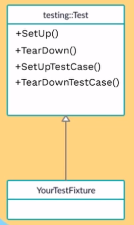
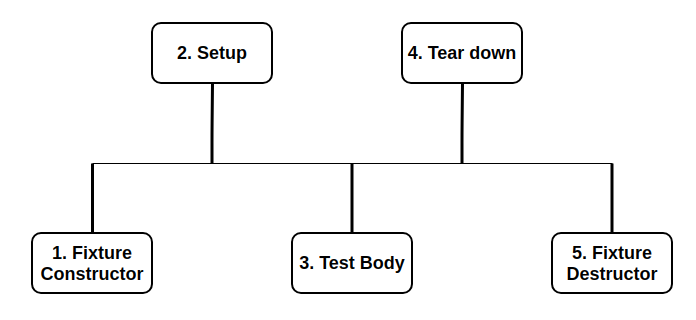

# Test Fixtures

## Test Fixtures: Using the Same Data Configuration for Multiple Tests {#same-data-multiple-tests}

If you find yourself writing two or more tests that operate on similar data, you
can use a *test fixture*. This allows you to reuse the same configuration of
objects for several different tests.



To create a fixture:

1.  Derive a class from `::testing::Test` . Start its body with `protected:`, as
    we'll want to access fixture members from sub-classes.
2.  Inside the class, declare any objects you plan to use.
3.  If necessary, write a default constructor or `SetUp()` function to prepare
    the objects for each test. A common mistake is to spell `SetUp()` as
    **`Setup()`** with a small `u` - Use `override` in C++11 to make sure you
    spelled it correctly.
4.  If necessary, write a destructor or `TearDown()` function to release any
    resources you allocated in `SetUp()` . To learn when you should use the
    constructor/destructor and when you should use `SetUp()/TearDown()`, read
    the [FAQ](faq.md#CtorVsSetUp).
5.  If needed, define subroutines for your tests to share.

When using a fixture, use `TEST_F()` instead of `TEST()` as it allows you to
access objects and subroutines in the test fixture:

```c++
TEST_F(TestFixtureName, TestName) {
  ... test body ...
}
```

Like `TEST()`, the first argument is the test suite name, but for `TEST_F()`
this must be the name of the test fixture class. You've probably guessed: `_F`
is for fixture.

Unfortunately, the C++ macro system does not allow us to create a single macro
that can handle both types of tests. Using the wrong macro causes a compiler
error.

Also, you must first define a test fixture class before using it in a
`TEST_F()`, or you'll get the compiler error "`virtual outside class
declaration`".

For each test defined with `TEST_F()`, googletest will create a *fresh* test
fixture at runtime, immediately initialize it via `SetUp()`, run the test,
clean up by calling `TearDown()`, and then delete the test fixture. Note that
different tests in the same test suite have different test fixture objects, and
googletest always deletes a test fixture before it creates the next one.
googletest does **not** reuse the same test fixture for multiple tests. Any
changes one test makes to the fixture do not affect other tests.

As an example, let's write tests for a FIFO queue class named `Queue`, which has
the following interface:

```c++
template <typename E>  // E is the element type.
class Queue {
 public:
  Queue();
  void Enqueue(const E& element);
  E* Dequeue();  // Returns NULL if the queue is empty.
  size_t size() const;
  ...
};
```

First, define a fixture class. By convention, you should give it the name
`FooTest` where `Foo` is the class being tested.

```c++
class QueueTest : public ::testing::Test {
 protected:
  void SetUp() override {
     q1_.Enqueue(1);
     q2_.Enqueue(2);
     q2_.Enqueue(3);
  }

  // void TearDown() override {}

  Queue<int> q0_;
  Queue<int> q1_;
  Queue<int> q2_;
};
```

In this case, `TearDown()` is not needed since we don't have to clean up after
each test, other than what's already done by the destructor.

Now we'll write tests using `TEST_F()` and this fixture.

```c++
TEST_F(QueueTest, IsEmptyInitially) {
  EXPECT_EQ(q0_.size(), 0);
}

TEST_F(QueueTest, DequeueWorks) {
  int* n = q0_.Dequeue();
  EXPECT_EQ(n, nullptr);

  n = q1_.Dequeue();
  ASSERT_NE(n, nullptr);
  EXPECT_EQ(*n, 1);
  EXPECT_EQ(q1_.size(), 0);
  delete n;

  n = q2_.Dequeue();
  ASSERT_NE(n, nullptr);
  EXPECT_EQ(*n, 2);
  EXPECT_EQ(q2_.size(), 1);
  delete n;
}
```

The above uses both `ASSERT_*` and `EXPECT_*` assertions. The rule of thumb is
to use `EXPECT_*` when you want the test to continue to reveal more errors after
the assertion failure, and use `ASSERT_*` when continuing after failure doesn't
make sense. For example, the second assertion in the `Dequeue` test is
`ASSERT_NE(nullptr, n)`, as we need to dereference the pointer `n` later, which
would lead to a segfault when `n` is `NULL`.

When these tests run, the following happens:

1.  googletest constructs a `QueueTest` object (let's call it `t1`).
2.  `t1.SetUp()` initializes `t1`.
3.  The first test (`IsEmptyInitially`) runs on `t1`.
4.  `t1.TearDown()` cleans up after the test finishes.
5.  `t1` is destructed.
6.  The above steps are repeated on another `QueueTest` object, this time
    running the `DequeueWorks` test.


## Fixture Flow 

The following are called in the blow order:

1. Fixture Constructor
2. Test SetUp
3. Test Body
4. Test TearDown
5. Fixture Destructor



What is the need of Setup and Teardown if the constructor is called at the beginning of the each test and destructor is called at the end of the each test?

Use of constructor and desctructor:
- We can make our attributes `const` and initialize in constructor
- In the scenarios when we need to Subclass our test fixture, we may forget to explicitly call the `SetUp()` and `TearDown()`

Use of SetUp and TearDown:
- When we must call `virtual` methods. If we call a `virtual` method in the constructor, the call is not **Polymorphic** that means always the base method will get called.
- Do not use fatal assertions (`ASSERT_*`) in constructors - use SetUp
- Do not call code that can `throw` exceptions in the desctructor - use TearDown

## Parameterized Tests

Parameterized test is to execute the same test over and over again using different values. It helps developer to save time in executing same test which differs only in their inputs and expected results. 

## Value-Parameterized Tests

*Value-parameterized tests* allow you to test your code with different
parameters without writing multiple copies of the same test. This is useful in a
number of situations, for example:

*   You have a piece of code whose behavior is affected by one or more
    command-line flags. You want to make sure your code performs correctly for
    various values of those flags.
*   You want to test different implementations of an OO interface.
*   You want to test your code over various inputs (a.k.a. data-driven testing).
    This feature is easy to abuse, so please exercise your good sense when doing
    it!

### How to Write Value-Parameterized Tests

To write value-parameterized tests, first you should define a fixture class. It
must be derived from both `testing::Test` and `testing::WithParamInterface<T>`
(the latter is a pure interface), where `T` is the type of your parameter
values. For convenience, you can just derive the fixture class from
`testing::TestWithParam<T>`, which itself is derived from both `testing::Test`
and `testing::WithParamInterface<T>`. `T` can be any copyable type. If it's a
raw pointer, you are responsible for managing the lifespan of the pointed
values.

NOTE: If your test fixture defines `SetUpTestSuite()` or `TearDownTestSuite()`
they must be declared **public** rather than **protected** in order to use
`TEST_P`.

```c++
class FooTest :
    public testing::TestWithParam<const char*> {
  // You can implement all the usual fixture class members here.
  // To access the test parameter, call GetParam() from class
  // TestWithParam<T>.
};

// Or, when you want to add parameters to a pre-existing fixture class:
class BaseTest : public testing::Test {
  ...
};
class BarTest : public BaseTest,
                public testing::WithParamInterface<const char*> {
  ...
};
```

Then, use the `TEST_P` macro to define as many test patterns using this fixture
as you want. The `_P` suffix is for "parameterized" or "pattern", whichever you
prefer to think.

```c++
TEST_P(FooTest, DoesBlah) {
  // Inside a test, access the test parameter with the GetParam() method
  // of the TestWithParam<T> class:
  EXPECT_TRUE(foo.Blah(GetParam()));
  ...
}

TEST_P(FooTest, HasBlahBlah) {
  ...
}
```

Finally, you can use `INSTANTIATE_TEST_SUITE_P` to instantiate the test suite
with any set of parameters you want. googletest defines a number of functions
for generating test parameters. They return what we call (surprise!) *parameter
generators*. Here is a summary of them, which are all in the `testing`
namespace:

<!-- mdformat off(github rendering does not support multiline tables) -->

| Parameter Generator                                                                       | Behavior                                                                                                          |
| ----------------------------------------------------------------------------------------- | ----------------------------------------------------------------------------------------------------------------- |
| `Range(begin, end [, step])`                                                              | Yields values `{begin, begin+step, begin+step+step, ...}`. The values do not include `end`. `step` defaults to 1. |
| `Values(v1, v2, ..., vN)`                                                                 | Yields values `{v1, v2, ..., vN}`.                                                                                |
| `ValuesIn(container)` and  `ValuesIn(begin,end)`                                          | Yields values from a C-style array, an  STL-style container, or an iterator range `[begin, end)`                  |
| `Bool()`                                                                                  | Yields sequence `{false, true}`.                                                                                  |
| `Combine(g1, g2, ..., gN)`                                                                | Yields all combinations (Cartesian product) as std\:\:tuples of the values generated by the `N` generators.       |

<!-- mdformat on-->

For more details, see the comments at the definitions of these functions.

The following statement will instantiate tests from the `FooTest` test suite
each with parameter values `"meeny"`, `"miny"`, and `"moe"`.

```c++
INSTANTIATE_TEST_SUITE_P(InstantiationName,
                         FooTest,
                         testing::Values("meeny", "miny", "moe"));
```

NOTE: The code above must be placed at global or namespace scope, not at
function scope.

Per default, every `TEST_P` without a corresponding `INSTANTIATE_TEST_SUITE_P`
causes a failing test in test suite `GoogleTestVerification`. If you have a test
suite where that omission is not an error, for example it is in a library that
may be linked in for other reason or where the list of test cases is dynamic and
may be empty, then this check can be suppressed by tagging the test suite:

```c++
GTEST_ALLOW_UNINSTANTIATED_PARAMETERIZED_TEST(FooTest);
```

To distinguish different instances of the pattern (yes, you can instantiate it
more than once), the first argument to `INSTANTIATE_TEST_SUITE_P` is a prefix
that will be added to the actual test suite name. Remember to pick unique
prefixes for different instantiations. The tests from the instantiation above
will have these names:

*   `InstantiationName/FooTest.DoesBlah/0` for `"meeny"`
*   `InstantiationName/FooTest.DoesBlah/1` for `"miny"`
*   `InstantiationName/FooTest.DoesBlah/2` for `"moe"`
*   `InstantiationName/FooTest.HasBlahBlah/0` for `"meeny"`
*   `InstantiationName/FooTest.HasBlahBlah/1` for `"miny"`
*   `InstantiationName/FooTest.HasBlahBlah/2` for `"moe"`

You can use these names in [`--gtest_filter`](#running-a-subset-of-the-tests).

This statement will instantiate all tests from `FooTest` again, each with
parameter values `"cat"` and `"dog"`:

```c++
const char* pets[] = {"cat", "dog"};
INSTANTIATE_TEST_SUITE_P(AnotherInstantiationName, FooTest,
                         testing::ValuesIn(pets));
```

The tests from the instantiation above will have these names:

*   `AnotherInstantiationName/FooTest.DoesBlah/0` for `"cat"`
*   `AnotherInstantiationName/FooTest.DoesBlah/1` for `"dog"`
*   `AnotherInstantiationName/FooTest.HasBlahBlah/0` for `"cat"`
*   `AnotherInstantiationName/FooTest.HasBlahBlah/1` for `"dog"`

Please note that `INSTANTIATE_TEST_SUITE_P` will instantiate *all* tests in the
given test suite, whether their definitions come before or *after* the
`INSTANTIATE_TEST_SUITE_P` statement.

You can see [sample7_unittest.cc] and [sample8_unittest.cc] for more examples.

[sample7_unittest.cc]: ../samples/sample7_unittest.cc "Parameterized Test example"
[sample8_unittest.cc]: ../samples/sample8_unittest.cc "Parameterized Test example with multiple parameters"

### Creating Value-Parameterized Abstract Tests

In the above, we define and instantiate `FooTest` in the *same* source file.
Sometimes you may want to define value-parameterized tests in a library and let
other people instantiate them later. This pattern is known as *abstract tests*.
As an example of its application, when you are designing an interface you can
write a standard suite of abstract tests (perhaps using a factory function as
the test parameter) that all implementations of the interface are expected to
pass. When someone implements the interface, they can instantiate your suite to
get all the interface-conformance tests for free.

To define abstract tests, you should organize your code like this:

1.  Put the definition of the parameterized test fixture class (e.g. `FooTest`)
    in a header file, say `foo_param_test.h`. Think of this as *declaring* your
    abstract tests.
2.  Put the `TEST_P` definitions in `foo_param_test.cc`, which includes
    `foo_param_test.h`. Think of this as *implementing* your abstract tests.

Once they are defined, you can instantiate them by including `foo_param_test.h`,
invoking `INSTANTIATE_TEST_SUITE_P()`, and depending on the library target that
contains `foo_param_test.cc`. You can instantiate the same abstract test suite
multiple times, possibly in different source files.

### Specifying Names for Value-Parameterized Test Parameters

The optional last argument to `INSTANTIATE_TEST_SUITE_P()` allows the user to
specify a function or functor that generates custom test name suffixes based on
the test parameters. The function should accept one argument of type
`testing::TestParamInfo<class ParamType>`, and return `std::string`.

`testing::PrintToStringParamName` is a builtin test suffix generator that
returns the value of `testing::PrintToString(GetParam())`. It does not work for
`std::string` or C strings.

NOTE: test names must be non-empty, unique, and may only contain ASCII
alphanumeric characters. In particular, they
[should not contain underscores](faq.md#why-should-test-suite-names-and-test-names-not-contain-underscore)

```c++
class MyTestSuite : public testing::TestWithParam<int> {};

TEST_P(MyTestSuite, MyTest)
{
  std::cout << "Example Test Param: " << GetParam() << std::endl;
}

INSTANTIATE_TEST_SUITE_P(MyGroup, MyTestSuite, testing::Range(0, 10),
                         testing::PrintToStringParamName());
```

Providing a custom functor allows for more control over test parameter name
generation, especially for types where the automatic conversion does not
generate helpful parameter names (e.g. strings as demonstrated above). The
following example illustrates this for multiple parameters, an enumeration type
and a string, and also demonstrates how to combine generators. It uses a lambda
for conciseness:

```c++
enum class MyType { MY_FOO = 0, MY_BAR = 1 };

class MyTestSuite : public testing::TestWithParam<std::tuple<MyType, std::string>> {
};

INSTANTIATE_TEST_SUITE_P(
    MyGroup, MyTestSuite,
    testing::Combine(
        testing::Values(MyType::VALUE_0, MyType::VALUE_1),
        testing::ValuesIn("", "")),
    [](const testing::TestParamInfo<MyTestSuite::ParamType>& info) {
      std::string name = absl::StrCat(
          std::get<0>(info.param) == MY_FOO ? "Foo" : "Bar", "_",
          std::get<1>(info.param));
      absl::c_replace_if(name, [](char c) { return !std::isalnum(c); }, '_');
      return name;
    });
```
## Summary

- A fixture is useful for removing code duplication.

- It's used where the setup phase and cleanup phase are similar.

- It's a class where the test setup is written in the `SetUp()` method and the cleanup is in `TearDown()`.

- A new fixture is created for each test.

- Parameterized tests can be used to generate tests that have the same body, but different input values.

- When you generate a test, the expected output values can be packed together with the input values using complex data structures.

- Generators can be used to generate input values for the test.


## References
1. [Google test Primer](https://github.com/google/googletest/blob/master/googletest/docs/primer.md#test-fixtures-using-the-same-data-configuration-for-multiple-tests)

2. [Google test Advance](https://github.com/google/googletest/blob/master/googletest/docs/advanced.md)