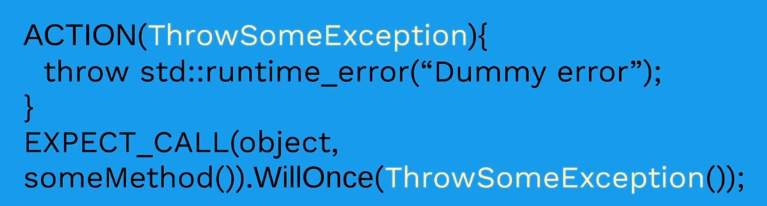

# Google Mock

## What is Mocking ?

## Other Types of Test doubles:

1. Fake

2. Stubs

3. Mock

## Mocking Methods

### Current Method 

A way to mock a method is by extending a class and instead of redefining the methods that you want to override you just have to use the `MOCK_METHOD` macro

`MOCK_METHOD(ReturnType, MethodName,(Arguments...))`

Examples:
  
1. method: `int sum(int a,int b)` ; 
Mock: `MOCK_METHOD(int,sum,(int,int))` .
Note: Arguments but be in parantheses
   
    

2. If the return type is complex type, then we need to use paranthesis as well in the returnType (param1 of MOCK_METHOD) as shown below

    

3. There is another parameter to this macro that is specs list that is optional:
`MOCK_METHOD(ReturnType, MethodName,(Arguments...), (Specs...))`
Specs must also be in the paranthesis.
Note that in the below example the empty arguments list is represented by `()` and `const` spec is also is in parantheses

    

### Legacy method

The old version of the macro looked as shown below

## Example used in 4_GMockProject

## Setting expectation and behaviour

How to make a method behave a certain way?
We have `ON_CALL` macro for that. It specifies the behaviour when the method is called.

`ON_CALL` is rarely used most of the times `EXPECT_CALL` is used. `EXPECT_CALL` does what `ON_CALL` does and in addition to that adds expectation to test, if the test does not meet that expectation, test fails.

Example:

**Setting Mock Behaviour**

To set a certain behaviour we can use `ACTION` macro. Then in the `ON_CALL` or `EXPECT_CALL` we can invoke that ``ACTION`` as in the example below.

The `EXCEPT_CALL` can invoke an `ACTION` using the following functions:

Similarly we can harcode the return value in the following way: 

To verify that the method was called after `EXPECT_CALL` we can use the one of the following:

## Matchers

To check the method was called with a certain value, google mock has matchers for that.

Examples:
1. Exact value

2. To check that the argument is greater or lower than certain value

similar matchers

to have any argument underscore can be used

to check if the argument is Null or Not Null

To check if the argument contains string/sub string

### Combining Matchers

Combination of matchers can be used to check for arguments

Matchers can be combined using the following:

- `AllOf()`
- `AnyOf()`
- `AllOfArray()`
- `AnyOfArray()`
- `Not()`

Matchers need not be only used with `EXPECT_CALL`, it can also be used in `ASSERT_THAT` assertions.

